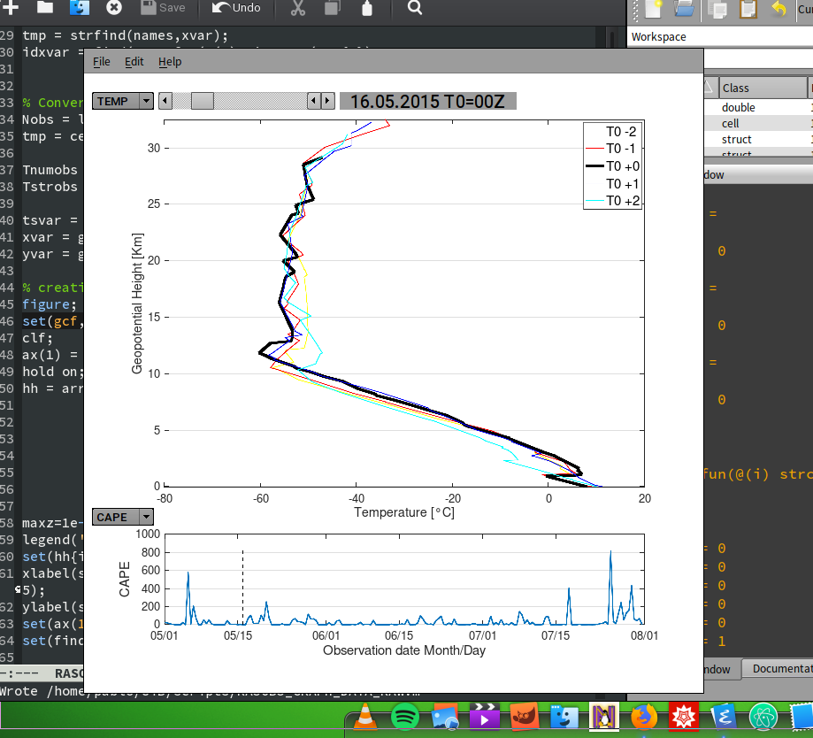

# WyoRASOBS (Wyoming University RAdiosondeS OBSservations)

## A GNU/Octave & MATLAB Automatic fetch and storage interface for Radiosonde data provided by the University of Wyoming

This is a simple MATLAB and Octave friendly function to fetch radiosonde data from the publich repository hosted by the University of Wyoming.

### Description
This MATLAB/GNU Octave function gets the DATA of the soundings (raob) from the Wyoming University internet site (http://weather.uwyo.edu)

The Function can be used by calling one or any combinations of the following set of parameters:

    > [data, {metinfo}] = RASOBS_DOWNLOAD_DATA_RAW(station,year,month,day,hour);
  
    > [data, {metinfo}] = RASOBS_DOWNLOAD_DATA_RAW(station,year,month,day,hour,'outputpath','/whereto/storage/data/');
  
    > [data, {metinfo}] = RASOBS_DOWNLOAD_DATA_RAW(station,year,month,day,hour,'netcdf',true);
  
    > [data, {metinfo}] = RASOBS_DOWNLOAD_DATA_RAW(station,year,month,day,hour,'csvfile',true);
  
    > [data, {metinfo}] = RASOBS_DOWNLOAD_DATA_RAW(station,year,month,day,hour,'matfile',true);

where,
INPUT VARIABLES

    % station-> (string) Code for the station to download;
    % year  --> (numeric) Range for Year of the date we want to download, e.g. [2015:2018];
    % month --> (numeric) Range for Month of the date we want to dowload, e.g. [10:12];
    % day   --> (numeric) Range for Day of the date we want to download, e.g. [1:31];
    % hour  --> (numeric) Range for Hour of the date we want to download [00,12];
    %           hour will accept any range of hours, but Wyoming University only has two radiosonde per day at 00 and 12Z.
FOLLOWING OPTION INPUTS (keyword value pairs)

    % 'netcdf', true/false --> whether to storage as NetCDF file (recomended for large datasets and portability);
    % 'csvfile', true/false --> whether to storage as CSV files (creates one file per hour, feasable for short datasets);
    % 'matfile', true/false --> whether to storage as v7 MATLAB files (recomended when use only with Matlab/Octave);
    % 'outputpath','/path_to/storage/' --> Dir where files are storaged (see below for default storage directory);

Default options:

    % 'outputpath'->'../data/RASOBS/station/yyyy/',
    % 'matfile'->true,
    % 'csvfile'->false,
    % 'netcdf'->false.

OUTPUT VARIABLES:

    % data --> MATLAB Structure variable containing the Radiosonde data and related information.
    % In case of unsuccessful downloading (e.g. hour 10 doesn't exist) it returns an empty variable or skip that hour.
OPTIONAL OUTPUT:

    % metinfo --> MATLAB Structure variable with Sounding Station Parameters and Indices for every
    % profile (for a extended description of indices, see HTML http://weather.uwyo.edu/upperair/indices.html).
    
Downloaded data can be archived in one or any combination of following file formats -> CSV, NetCDF or MATLAB binary format (depending on optional input value pairs the data archive will have a generic name e.g. `RS_Y[year1]-[year2]_M[month1]-[month2]_D[day1]-[day2]_H[hour1]-[hour2].nc` or `RS_Y[year1]-[year2]_M[month1]-[month2]_D[day1]-[day2]_H[hour1]-[hour2].mat`). For the case of CSV format one file per hour is created, therefore CSV format is suggested to use only with small datasets.

The new generated file is saved by default in the following folder: `'../data/RASOBS/namestation/yyyy/'` or in any other directory if specified by the `'outputpath'` option. 

The variable name, description and units of the profile variables (columnwise) are stored as a member variable named `PROFILE_META` in the optional structure output `metinfo`, i.e. 

    > metinfo.PROFILE_META{1:3}
    ans =
    {
    [1,1] = PRES
    [1,2] = Atmospheric Pressure
    [1,3] = hPa
    }

    ans =
    {
    [1,1] = HGHT
    [1,2] = Geopotential Height
    [1,3] = m
    }

    ans =
    {
    [1,1] = TEMP
    [1,2] = Temperature
    [1,3] = °C
    }
    
In case of storage in NetCDF format, the units are displayed as argument for every available variable.

### Description of the profile variables
A detailed description of the variables in the profile is provided by the Wyoming University web site:
http://weather.uwyo.edu/upperair/columns.html

### Description of the Sounding indices
Similrly a detailed description of the Radiosonde indices is provided by the Wyoming University web site:
http://weather.uwyo.edu/upperair/indices.html

## USAGE EXAMPLE
This is an example to download data from the Station Norderney with station number '10113' for the year 2015, the months of Mai, June and July (`[5:7]`) and all available hours i.e. 00 and 12Z (`[0,12]`) and storaging the data as NetCDF file.

    >> [data,metinfo] = RASOBS_DOWNLOAD_DATA_RAW('10113',2015,[5:7],[1:31],[00,12],'netcdf',true);
    
    warning: Data from 06.31.2015_00UTC does not exist!
    warning: Data from 06.31.2015_12UTC does not exist!
    warning: Data from 07.27.2015_00UTC does not exist!
    warning: called from RASOBS_DOWNLOAD_DATA_RAW at line 175 column 21
    
for the example above, the process to download and storage took approximatelly 2.7 minutes with GNU Octave.

    >> whos data
    Variables in the current scope:
    Attr Name        Size                     Bytes  Class
    ==== ====        ====                     =====  =====
        data        1x183                  1705968  struct

    >> whos metinfo
    Variables in the current scope:
    Attr Name         Size                     Bytes  Class
    ==== ====         ====                     =====  =====
        metinfo      1x1                      41013  struct

The data will the then storaged in a NetCDF file in the default directory `../data/norderney/2015/` with a file name `RS_Y2015-2015_M05-07_D01-31_H00-12.nc`.

## SIMPLE PLOTTING EXAMPLE
To help visualize the downloaded Radiosonde data, a simple GNU Octave/Matlab script helps to navigate along the profiles.
### For MAT binary files
Run the script from workspace as follow:

    >> RASOBS_GRAPH_DATA_RAW(data,{metinfo});
and a file browser will pop-up to select a `.mat` file with the Radiosonde data, or when the data are alredy loaded as workspace variable, use
   
    >> RASOBS_GRAPH_DATA_RAW(data,{metinfo});
where `data` is the structure variable with the profiles, and `metinfo` is the structure variable with the Radiosonde indexed (see above). The script creates a Figure as it is shown in the following screenshot:

the top panel shows the profile and the bottom panel the time-series of the selected Radiosonde Indexes. By using the pop-up menus it is possible to change the variables to show, and by moving the horizontal slice it is possible to change the observation time.

The profile is shown in color black for the selected time and for reference it also includes 2 profiles before (yellow and red) and 2 after (blue and cyan) which are indicated on the legend by T0-2, T0-1, etc. where T0 is the date and time indicated at the top of the figure, e.g. _16.5.2015 T0=00Z_ in the above figure.

### For NetCDF files
When the Radiosonde data has been storaged as NetCDF file, it can be easily visualized by any software, for a quick peak `ncview` can be used

    /home/user:~/wyorasobs/data/2015> ncview RS_Y2015-2015_M05-07_D01-31_H00-12.nc &
and by selecting any profile variable a 2D time series can be easily plotted, for instance for the temperature variable `TEMP`

### For CSV Files
The visualization for the .csv files is not supported.

(c) 2018 P. Saavedra Garfias, Geophysical Institute, UNIVERSITY OF BERGEN
See LICENSE.TXT
