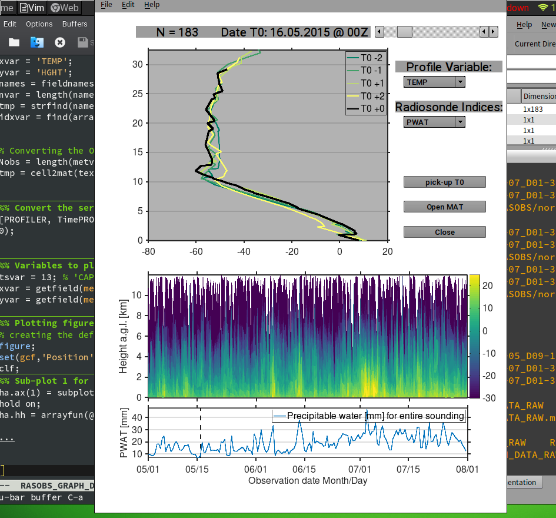

# WyoSondes (Wyoming University Radiosondes Observations)

## A GNU/Octave & MATLAB Automatic fetch and storage interface for Radiosonde data provided by the University of Wyoming

This is a simple GNU/Octave and MATLAB friendly function to fetch radiosonde data from the publich repository hosted by the University of Wyoming.

This repository has been mainly developed and intensily used with GNU/Octave v4.4.0 under Linux OpenSuse distribution. Some testing has been done for Matlab R2016b (the one I have at office), but some issues might appear with the latest Matlab versions, so any feedbacks are welcome.

### Description
This GNU Octave/MATLAB function gets the DATA of the soundings (raob) from the Wyoming University internet site (http://weather.uwyo.edu)

The Function can be used by calling one or any combinations of the following set of parameters:
```
>> [data, metvar, {metadata}] = RASOBS_DOWNLOAD_DATA_RAW(station,year,month,day,hour);
  
>> [data, metvar, {metadata}] = RASOBS_DOWNLOAD_DATA_RAW(station,year,month,day,hour,'outputpath','/whereto/storage/data/');
  
>> [data, metvar, {metadata}] = RASOBS_DOWNLOAD_DATA_RAW(station,year,month,day,hour,'netcdf',true);
  
>> [data, metvar, {metadata}] = RASOBS_DOWNLOAD_DATA_RAW(station,year,month,day,hour,'csvfile',true);
  
>> [data, metvar, {metadata}] = RASOBS_DOWNLOAD_DATA_RAW(station,year,month,day,hour,'matfile',true);
```
where,
INPUT VARIABLES
```
% station-> (string) Code for the station to download;
% year  --> (numeric) Range for Year of the date we want to download, e.g. [2015:2018];
% month --> (numeric) Range for Month of the date we want to dowload, e.g. [10:12];
% day   --> (numeric) Range for Day of the date we want to download, e.g. [1:31];
% hour  --> (numeric) Range for Hour of the date we want to download [00,12];
%           hour will accept any range of hours, but Wyoming University only has two radiosonde per day at 00 and 12Z.
```
FOLLOWING OPTION INPUTS (keyword value pairs)
```
% 'netcdf', true/false --> whether to storage as NetCDF file (recomended for large datasets and portability);
% 'csvfile', true/false --> whether to storage as CSV files (creates one file per hour, feasable for short datasets);
% 'matfile', true/false --> whether to storage as v7 MATLAB files (recomended when use only with Matlab/Octave);
% 'outputpath','/path_to/storage/' --> Dir where files are storaged (see below for default storage directory);
```
Default options:
```
% 'outputpath'->'../data/RASOBS/station/yyyy/',
% 'matfile'->true,
% 'csvfile'->false,
% 'netcdf'->false.
```
OUTPUT VARIABLES:
```
% data --> MATLAB Structure variable containing the Radiosonde data and related information. 
% metvar --> MATLAB Structure variable with Sounding Station Parameters and Indices for every profile.
```
In case of unsuccessful downloading (e.g. hour 10 doesn't exist) it returns an empty variable or skip that hour.

OPTIONAL OUTPUT:
```    
% metadata --> structure with two fields containing the METADATA describing every profile and Indice variable (for a extended description of indices, see HTML http://weather.uwyo.edu/upperair/indices.html)
``` 
Downloaded data can be archived in one or any combination of following file formats -> CSV, NetCDF or MATLAB binary format. Depending on the input values a data archive will have a generic name like
```
RS_Y[year1]-[year2]_M[month1]-[month2]_D[day1]-[day2]_H[hour1]-[hour2].nc
```
or
```
RS_Y[year1]-[year2]_M[month1]-[month2]_D[day1]-[day2]_H[hour1]-[hour2].mat
```
For the case of CSV format one file per hour is created, therefore CSV format is suggested to use only with small datasets.

The new generated file is saved by default in the following folder: `'../data/RASOBS/namestation/yyyy/'` or in any other directory if specified by the `'outputpath'` option. 

The variable name, description and units of the profile variables (columnwise) are stored as a member variable named `PROFILE_META` in the optional structure output `metvar`, i.e. 
```
>> metvar.PROFILE(1:3,:)
ans =
{
  [1,1] = PRES
  [2,1] = HGHT
  [3,1] = TEMP
  [1,2] = Atmospheric Pressure
  [2,2] = Geopotential Height
  [3,2] = Temperature
  [1,3] = hPa
  [2,3] = m
  [3,3] = °C
}
>> metadata.RSINDICES(1:3,:)
ans =
{
  [1,1] = OBST
  [2,1] = SLAT
  [3,1] = SLON
  [1,2] = Observation time
  [2,2] = Station latitude
  [3,2] = Station longitude
  [1,3] = [YYMMDD.HH]
  [2,3] = deg North
  [3,3] = deg East
}
```
The metadat can be readed independently with the following auxilliary function:
```
>> metadata = WyoRS_metadata;
``` 
In case of storage in NetCDF format, the units are displayed as argument for every available variable.

### Description of the profile variables
A detailed description of the variables in the profile is provided by the Wyoming University web site:
http://weather.uwyo.edu/upperair/columns.html

### Description of the Sounding indices
Similrly a detailed description of the Radiosonde indices is provided by the Wyoming University web site:
http://weather.uwyo.edu/upperair/indices.html

## USAGE EXAMPLE
This is an example to download data from the Station Norderney with station number '10113' for the year 2015, the months of Mai, June and July (`[5:7]`) and all available hours i.e. 00 and 12Z (`[0,12]`) and storaging the data as NetCDF file.
```
>> [data,metvar] = RASOBS_DOWNLOAD_DATA_RAW('10113',2015,[5:7],[1:31],[00,12],'netcdf',true);
   
warning: Data from 06.31.2015_00UTC does not exist!
warning: Data from 06.31.2015_12UTC does not exist!
warning: Data from 07.27.2015_00UTC does not exist!
warning: called from RASOBS_DOWNLOAD_DATA_RAW at line 175 column 21
```    
for the example above, the process to download and storage took approximatelly 2.7 minutes with GNU Octave.
```
>> whos data
Variables in the current scope:
Attr Name        Size                     Bytes  Class
==== ====        ====                     =====  =====
     data        1x183                  1705968  struct

>> whos metvar
Variables in the current scope:
 Attr Name         Size                     Bytes  Class
 ==== ====         ====                     =====  =====
     metvar      1x1                      41013  struct
```
The data will the then storaged in a NetCDF file in the default directory `../data/norderney/2015/` with a file name `RS_Y2015-2015_M05-07_D01-31_H00-12.nc`.

## SIMPLE PLOTTING EXAMPLE
To help visualize the downloaded Radiosonde data, a simple GNU Octave/Matlab script helps to navigate along the profiles. This script is more useful when a large number of profiles are present, for less than 5 or single profiles it isn't worth it.

### For MAT binary files
Run the script from workspace as follow:
```
>> RASOBS_GRAPH_DATA_RAW;
```
and a file browser will pop-up to select a `.mat` file with the Radiosonde data, or when the data are alredy loaded as workspace variable, use
```  
>> RASOBS_GRAPH_DATA_RAW(data,metvar);
```
where `data` is the structure variable with the profiles, and `metvar` is the structure variable with the Radiosonde indexed (see above). The script creates a Figure as it is shown in the following screenshot:
```
>> ha = RASOBS_GRAPH_DATA_RAW(data,metvar);
```
where `ha` is the structure of handles for the graphical elements, i.e. plot lines, axes, GUI's controls, etc.


the top panel shows the vertical profile or the selected variable (default `TEMP`), the middle panel shows the time-series of vertical profiles in a 2D surface plot (same variable as the top panel but only 10km height is considered) and in the bottom panel the time-series of the selected Radiosonde Indexes (default `CAPE`).

By using the pop-up menus it is possible to select other variables to show, and by moving the horizontal slice on top it is possible to change the observation time, alternatively the **`pick-up T0`** buttom allows to select a time point with the cursor from any of the two time-series plots.

The profile is shown in color black for the selected time and for reference it also includes 2 profiles before and 2 after which are indicated on the legend by T0-2, T0-1, etc. where T0 is the date and time indicated at the top, e.g. _16.5.2015 T0=00Z_ in the figure above.

### For NetCDF files
When the Radiosonde data has been storaged as NetCDF file, it can be easily visualized by any third-party software, for a quick peak `ncview` can be used
```
/home/user:~/wyorasobs/data/2015> ncview RS_Y2015-2015_M05-07_D01-31_H00-12.nc &
```
and by selecting any profile variable a 2D time series can be easily plotted, for instance for the temperature variable `TEMP`

### For CSV Files
The visualization for the .csv files is not supported.


(c) 2018 P. Saavedra Garfias, Geophysical Institute, UNIVERSITY OF BERGEN

See LICENSE.TXT
